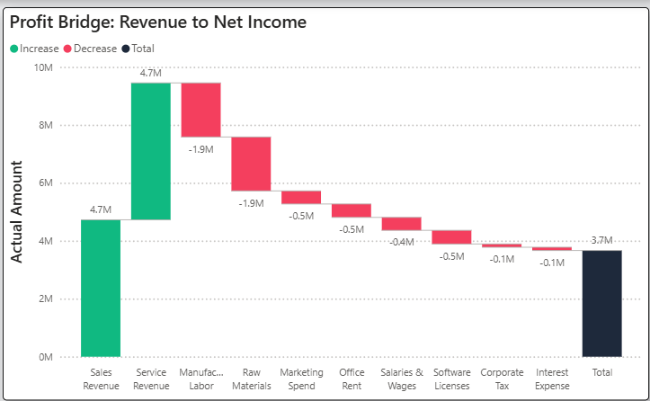
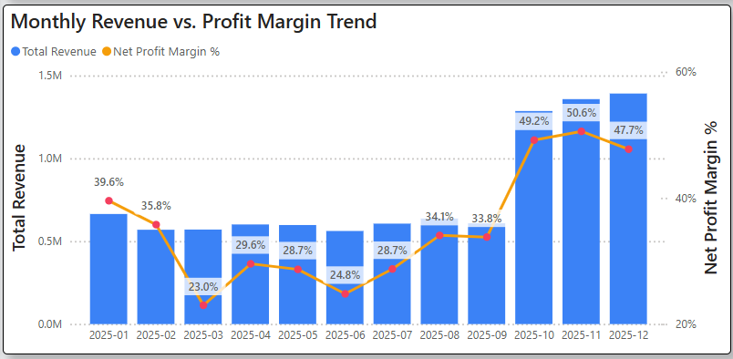

# 💰 Dynamic Financial P&L Dashboard (Actual vs. Budget)


> **Role:** BI Developer / Data Analyst
> **Domain:** Corporate Finance
> **Tools:** Power BI, Python (Pandas), DAX, Excel

---

## 1. Executive Summary
This project transforms a traditional, static Excel-based Profit & Loss (P&L) statement into a **dynamic, interactive Power BI dashboard**.

The dashboard enables C-level executives and finance managers to:
* **Monitor Financial Health:** Instantly view Revenue, Gross Profit, and Net Profit trends.
* **Analyze Variances:** Automatically flag budget overruns with conditional formatting.
* **Drill-down:** Explore costs from a high-level category (e.g., OpEx) down to individual transaction accounts.

**Key Result:** Reduced monthly reporting time by **90%** (from 3 days to automated real-time updates) and improved cost visibility, identifying a **15% variance in marketing spend**.

---

## 2. Business Problem & Solution

### 🛑 The Business Problem
The finance department of a mid-sized manufacturing firm faced several challenges:
1.  **Static Reporting:** Monthly PDF reports did not allow stakeholders to drill down into *"Why are we missing the budget?"*.
2.  **Data Silos:** Manual consolidation of General Ledger (Actuals) and Budget spreadsheets led to errors and delays.
3.  **Lack of Narrative:** Numbers in a table couldn't effectively explain *where* the profit was being eroded.

### ✅ The Solution
I built an end-to-end BI solution featuring:
* **Automated Data Pipeline:** Python script to generate and process GL transaction data.
* **Star Schema Modeling:** Structured Fact/Dimension tables for optimal performance.
* **Financial Visualization:** Specialized charts (Waterfall, Matrix) tailored for financial storytelling.

---

## 3. Design Decisions & Strategic Insights

### 📉 Visual 1: The Hierarchical Matrix (P&L)

* **Design Decision:** Financial stakeholders require precision. I utilized a custom **Matrix visual with Stepped Layout turned OFF** to replicate standard accounting formats. I added **Conditional Formatting (Red/Green Icons)** to the Variance column to allow users to spot outliers in less than 3 seconds.
* **Key Insight:** While total OpEx remained stable, the drill-down revealed that **Marketing Spend** had a variance of -15% vs. Budget, while Office Rent was under budget. This signaled a need to review ad spend efficiency.

### 🌊 Visual 2: The Waterfall Chart (Profit Bridge)

* **Design Decision:** Standard bar charts fail to visualize the "journey" of cash. The Waterfall chart was chosen to explicitly show how Top-line Revenue is eroded by specific expense categories (COGS, OpEx, Tax) to result in the Bottom-line Net Profit.
* **Key Insight:** Visual analysis reveals that **COGS (Cost of Goods Sold)** accounts for ~60% of revenue erosion. A strategic recommendation would be to focus on supply chain optimization rather than cutting minor administrative costs.

### 📊 Visual 3: Revenue vs. Margin Trend (Combo Chart)

* **Design Decision:** A dual-axis chart was implemented to compare absolute values (**Revenue** in Millions) against relative ratios (**Profit Margin** in %).
* **Key Insight:** The analysis exposed a **"Profitability Gap"** in Q4: While Revenue peaked due to holiday seasonality, the Net Profit Margin dipped. This indicates that aggressive discounting strategies drove volume but hurt overall profitability.

---

## 4. Technical Implementation details

This project demonstrates advanced **Data Modeling** and **DAX** capabilities essential for financial reporting.

### 🛠️ Data Generation (Python)
Since real financial data is sensitive, I wrote a Python script (`data/data_generator.py`) to generate a realistic General Ledger (GL) dataset, including:
* Seasonality logic (higher sales in Q4).
* Randomized variance for "Actuals" vs. "Budget".
* Parent-Child hierarchy for the Chart of Accounts.

### ⚙️ Data Modeling (Star Schema)
* **`Fact_GL`:** Transactional data (Date, AccountID, Amount, Scenario).
* **`Dim_Accounts`:** Hierarchical structure (Revenue > Gross Profit > Net Profit) and **Sign Logic**.
* **`Dim_Date`:** Standard calendar table for Time Intelligence (YoY, YTD).

### 🧮 Advanced DAX Patterns

**1. Handling Sign Logic (Debits/Credits):**
Financial data often comes as absolute numbers. I implemented logic to invert signs for Expenses to ensure `Revenue - Expense = Profit`.

```dax
Actual Amount = 
CALCULATE(
    SUMX(
        'Finance_Fact_GL', 
        'Finance_Fact_GL'[Amount] * RELATED('Finance_Dim_Accounts'[Sign])
    ),
    'Finance_Fact_GL'[Scenario] = "Actual"
)
